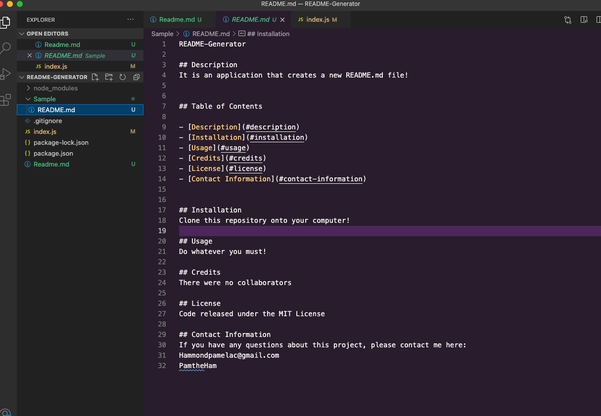

README-Generator

## Description
It is an application that uses the Inquirer NPM. The inquirer NPM utilizes the command line to prompt the user to answer questions. The README generator asks the user to input information about a project, and then the README generator creates a new README.md file and sticks the users input into that file.

Here is a link to the walk-through video: https://drive.google.com/file/d/1ELzVcqJXStM0IZciaNM_TzCERHBTH7jz/view 

## Table of Contents

- [Description](#description)
- [Installation](#installation)
- [Usage](#usage)
- [Credits](#credits)
- [License](#license)
- [Contact Information](#contact-information)

## Installation
1. Clone this repository into a file on your computer into whichever folder you prefer
2. Install Node.js
3. Install the Inquirer package
4. Enter 'node index.js' in the command line in an integrated terminal on the index.js file

## Usage
Use this application to easily and successfully create a professional README.md file.

## Credits
There were no other collaborators on this project, just me! 

## Challenges
The biggest challenge of this project was deciding which licenses to include in the README Generator. I stuck with the safe choice, and decided to use the licenses that GitHub lists when you are deciding which licenses are best to use for your project. 

## Contact Information
If you have any questions about this project, please email me here: Hammondpamelac@gmail.com. My GitHub username is: www.github.com/PamtheHam